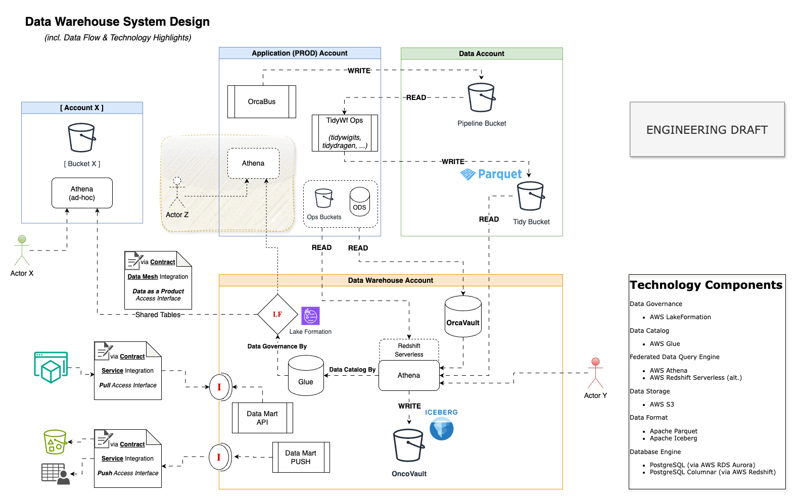
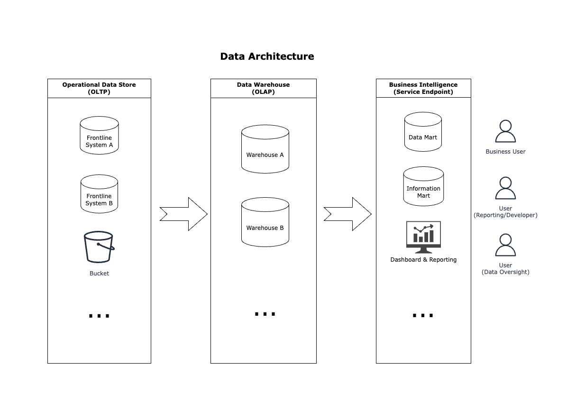
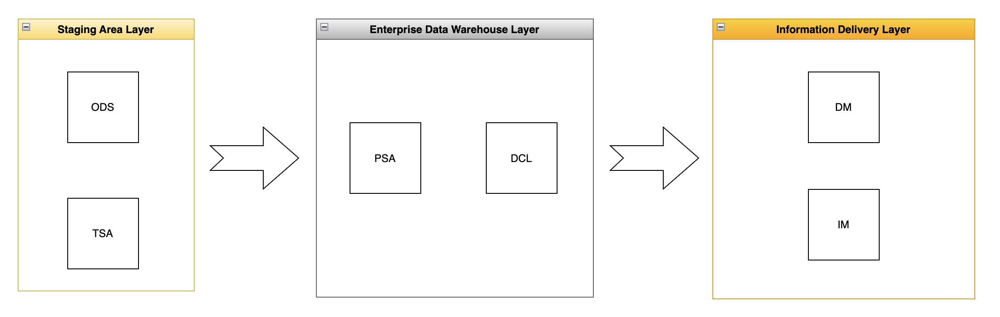

# High Level Architecture

## Data Warehouse System Design

* Source: [system_design.drawio](assets/system_design.drawio)

## Data Architecture

The Data Architecture (abstract) diagram provides a high-level overview of expected data flows.

The OrcaHouse project mainly involves at Data Warehouse and Business Intelligence data stages. 

## Data Layer

See [Glossary](../glossary.md) for terms.

Warehouse data pipeline is organised into high-level data layers. The upstream data stages are incrementally and progressively improved into the downstream data stages.

### Techniques

1. In order to achieve maximum _"closer-to-the-live"_ data freshness from frontline applications, we use [Foreign Data Wrapper](https://www.google.com/search?q=Foreign+Data+Wrapper) (FDW). With this technique, we mount all our frontline system databases into the Staging Area Layer under ODS schema as Read Only.
2. Sometime, we have data persisted elsewhere i.e. none RDBMS upstreams such as Spreadsheet. In this case, we temporarily stage the data into Staging Area Layer under TSA schema. Typically, we use [AWS Glue](https://docs.aws.amazon.com/glue/latest/dg/what-is-glue.html) to drive these data sources.
3. The key essence of data warehouse is keeping track of business facts and change records history. The level of details -  [data grain](https://www.google.com/search?q=data+grain) - is important. We practise both _conventional_ change data capture (CDC) pattern and Data Vault 2.0 methodology. This happens in PSA and DCL (DV2 patterns - Raw Vault/Business Vault) data schemas.
4. The Information Delivery Layer involves implementing business specific use cases or data marts. This follows implementing Dimensional Modelling (Kimball) technique or just straight to the Single Table Design (flat & wide, denormalized) or, even Relational ([Inmon](https://www.google.com/search?q=relational+Inmon)) design. Depending on the complexity of the use cases and requirements, we can select an appropriate modelling strategy at this layer.
