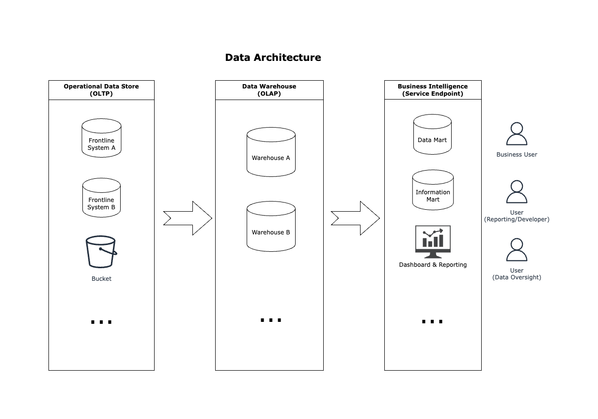

# Data Architecture

The Data Architecture diagram provides a high-level overview of expected data flows.

The OrcaHouse project mainly involves at Data Warehouse and Business Intelligence data stages. 

See [Glossary](../glossary.md) for terms.

## Data Pipeline and Layer

Warehouse data pipeline are organised into high level data layers. Similar to [medallion architecture](https://www.google.com/search?q=medallion+architecture). The upstream data stages are incrementally and progressively improved into downstream data stages.

### Techniques

1. In order to achieve maximum _"closer-to-the-live"_ data freshness from frontline applications, we use [Foreign Data Wrapper](https://www.google.com/search?q=Foreign+Data+Wrapper) (FDW). With this technique, we mount all our frontline system databases into the Staging Area Layer under ODS schema as Read Only.
2. Sometime, we have data persisted elsewhere i.e. none RDBMS upstreams such as Spreadsheet. In this case, we temporarily stage the data into Staging Area Layer under TSA schema. Typically, we use [AWS Glue](https://docs.aws.amazon.com/glue/latest/dg/what-is-glue.html) to drive these data sources.
3. The key essence of data warehouse is keeping track of business facts and change records history. The level of details -  [data grain](https://www.google.com/search?q=data+grain) - is important. We practise both _conventional_ change data capture (CDC) pattern and Data Vault 2.0 methodology. This happens in PSA and RAW (Raw Vault - DV2 pattern) data schemas.
4. The Data Consolidation Layer involves implementing business use cases such that later consumed by Data Mart and/or Information Mart. This follows implementing Business Vault (DV2 pattern) technique or Dimensional Modelling (Kimball) technique or just straight to the Data Mart (Single Table Design) or, even Relational ([Inmon](https://www.google.com/search?q=relational+Inmon)) design. Depending on the complexity of the use cases and requirements, we can select an appropriate modeling strategy at this layer.
