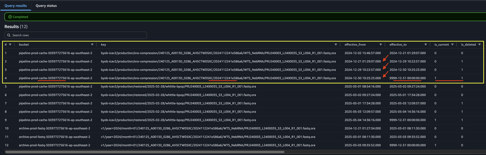

# Example 3

<!-- TOC -->
* [Example 3](#example-3)
  * [FASTQ by LibraryID](#fastq-by-libraryid)
  * [History Query](#history-query)
<!-- TOC -->


See the model guide [dbt](https://umccr.github.io/orcahouse-doc/dbt/orcavault/#!/model/model.orcavault.lims) and [erd](https://umccr.github.io/orcahouse-doc/erd/) for schema and column details.


## FASTQ by LibraryID

```sql
-- find me FASTQ files (R1, R2) by LibraryID
select * from fastq where library_id = 'L2400035';
```

Note the `storage_class` column is `DeepArchive` and, the bucket where they are located. This shows the read-level unaligned FASTQ files (R1, R2 pair) in the deep archive.

Next. How do this Library's FASTQ files get into this archival location? You can query the full history drill down for the trace and audit trail.

## History Query

At some point, you might want to query `fastq_history` table to trace FASTQ file movement i.e., historical locations of the file—where they have been, when they get deleted and where they are at now. Basically their "effective" time window at the said location.

As best practice; please use predicate filter with `WHERE` or, `LIMIT` clause when list the historical records to prevent over-fetching and, maintain query performance.

Example:

```sql
select * from fastq_history limit 10;
```

In most cases, you want to filter by `library_id`.

```sql
select * from fastq_history where library_id = 'L2400035';
```

Note that the history shows both R1, R2 as a pair. Let trace R1 only for clarity and demonstration.

```sql
select * from fastq_history where library_id = 'L2400035' and filename like '%R1%';
```

Now pay attention to columns `bucket, key, effective_from, effective_to, is_current, is_deleted, filename`.

By `filename`, observe that it is the same FASTQ file that has been going through different `bucket` and locations (i.e., `key` column) at a different point-in-time window (i.e., `effective_from` and `effective_to` columns) with a respective status flag about the file being current and/or deleted.

Now let's sort the query by location and effective start date.

```sql
select * from fastq_history where library_id = 'L2400035' and filename like '%R1%' order by key, effective_from;
```



By location sorted, you can find that there are three locations that this file went into. For all known location blocks (rows 1–4; rows 5–9; rows 10–12), the effective end date `effective_to` column with a future date denotes that this is the last known condition. Hence, it points to the current status about the location, whereas it may have been deleted (and superseded) to another location block.

```sql
select * from fastq_history where library_id = 'L2400035' and filename like '%R1%' and is_current = 1;
```

Finally, if you further filter by non-deleted state for the current location then this resolves to the current active location.

```sql
select * from fastq_history where library_id = 'L2400035' and filename like '%R1%' and is_current = 1 and is_deleted = 0;
```

Hence. This is how the `fastq` table is being curated for showing only the current effective location(s).

```sql
select * from fastq where library_id = 'L2400035';
```
