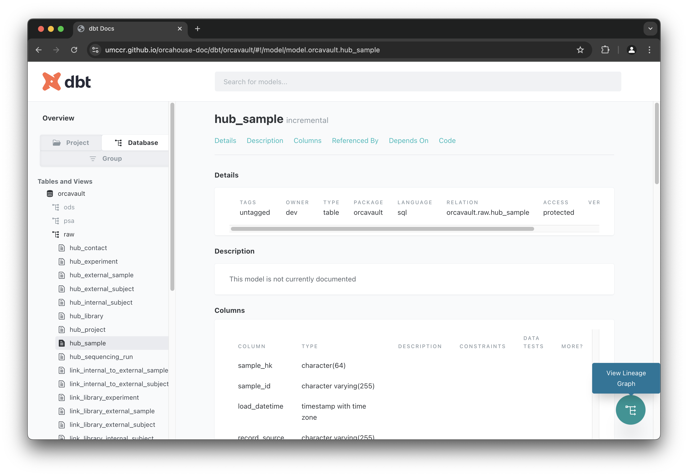
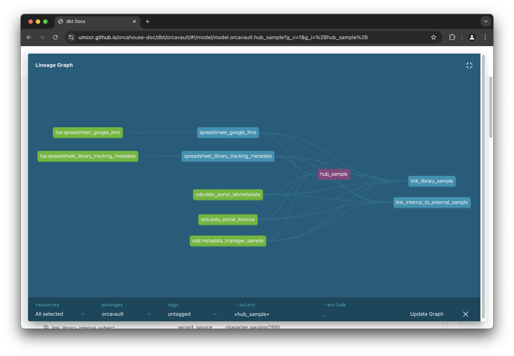

# dbt Model Guide

dbt Model documentation auto-generated by `dbt docs generate`. 

* The generated dbt doc can visualise data model dependency in Lineage Graph DAG (REF#2). 
* A directed acyclic graph (DAG) is a visual representation of data models and their connection to each other.

> NOTE: It is better browse via document website address at [https://umccr.github.io/orcahouse-doc/dbt/](https://umccr.github.io/orcahouse-doc/dbt/)

## Warehouse

- [OrcaVault](orcavault)

### REF

1. [https://docs.getdbt.com/docs/build/documentation](https://docs.getdbt.com/docs/build/documentation)
2. [https://www.getdbt.com/blog/guide-to-dags](https://www.getdbt.com/blog/guide-to-dags)

### TL;DR

* For the selected model, do check out data lineage graph button in the bottom right corner of the screen.
* It shows the model up/down stream data flow. 
  * e.g. the `hub_sample` shows what sources are, and then the down stream models that flow into...

