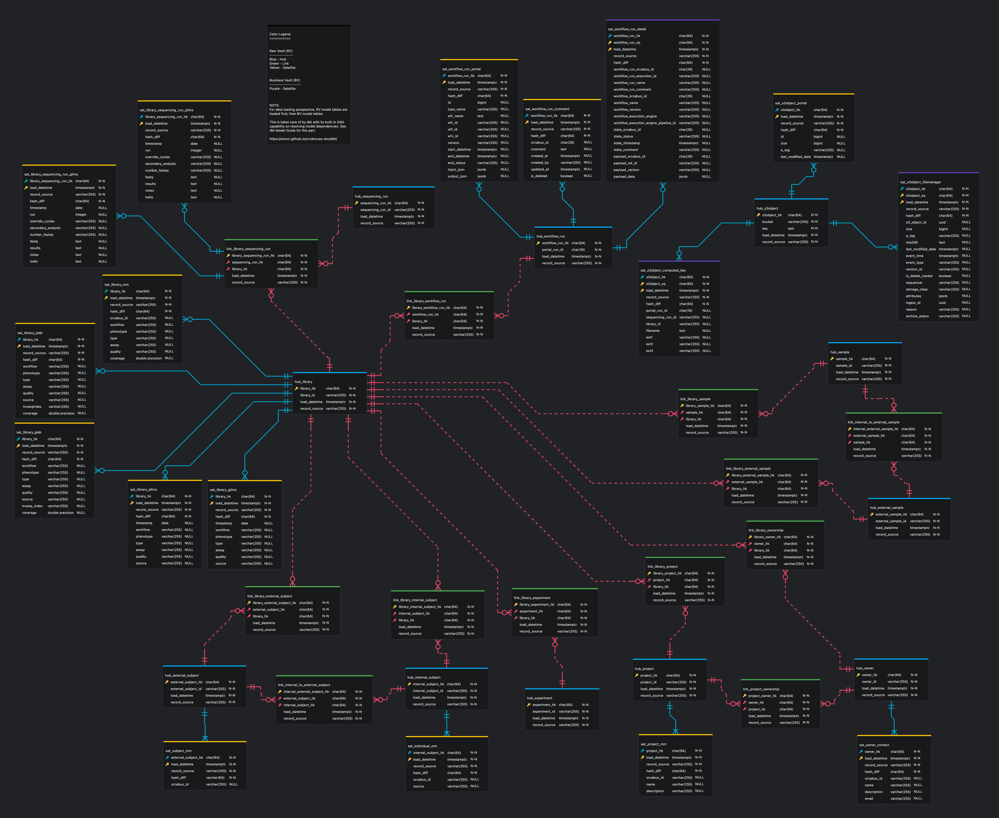

# erd Model Guide

> WIP

We use [https://github.com/dineug/erd-editor](https://github.com/dineug/erd-editor) tool to keeping tracked of "data model" being developed at different layers of warehouse. The following are recommended setup to visualise ERD model documentation.

## Model

- [orcavault_tsa.erd.json](orcavault/orcavault_tsa.erd.json)
- [orcavault_psa.erd.json](orcavault/orcavault_psa.erd.json)
- [orcavault_dcl.erd.json](orcavault/orcavault_dcl.erd.json)
- [orcavault_mart.erd.json](orcavault/orcavault_mart.erd.json)

## VSCode

1. Install Visual Studio Code (VSCode)
2. Install "ERD Editor" extension at [https://marketplace.visualstudio.com/items?itemName=dineug.vuerd-vscode](https://marketplace.visualstudio.com/items?itemName=dineug.vuerd-vscode)
3. Simply open the ERD model file e.g. `File > Open > orcavault/orcavault_dcl.erd.json`

## Online

1. Go to [https://erd-editor.io/](https://erd-editor.io/)
2. Click `New Schema` and give schema name: `orcavault_dcl`
3. Select `orcavault_dcl` schema at left panel. 
4. At right editor panel, `Right Click > Import > orcavault/orcavault_dcl.erd.json`

## Note

- Please note that ERD model published here may lag behind latest development.
- Using the online WebApp version stores changes only in your Browser cache storage. So do any changes made with VSCode IDE.
- For using ERD editor guide, refer to [https://docs.erd-editor.io/docs/category/guides/](https://docs.erd-editor.io/docs/category/guides/)

